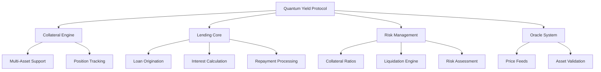

# Quantum Yield Protocol

[](https://github.com/mirable-josh/quantum-yield)
[](https://opensource.org/licenses/MIT)
[](https://stacks.co)
[](https://github.com/mirable-josh/quantum-yield)

> Revolutionary decentralized finance protocol enabling seamless asset-backed lending with institutional-grade risk management on the Stacks blockchain.

## 🌟 Overview

Quantum Yield transforms idle crypto holdings into productive capital through innovative collateral mechanisms and intelligent liquidation shields. Built for the future of finance, our protocol delivers unparalleled capital efficiency while maintaining bulletproof security through cutting-edge smart contract architecture.

### Key Features

- **🔬 Quantum Collateral Engine** - Advanced multi-asset collateral management system
- **📊 Adaptive Risk Matrices** - Dynamic protection against market volatility
- **🔮 Oracle Fusion Network** - Real-time, tamper-proof price discovery
- **⚡ Yield Optimization Layer** - Intelligent interest rate algorithms
- **🌐 Cross-Chain Infrastructure** - Seamless multi-blockchain integration ready
- **🛡️ Automated Liquidation Protection** - Smart risk assessment and position management

## 📋 Table of Contents

- [Architecture](#-architecture)
- [Getting Started](#-getting-started)
- [Smart Contract Interface](#-smart-contract-interface)
- [Protocol Mechanics](#-protocol-mechanics)
- [Security Features](#-security-features)
- [Development](#-development)
- [Testing](#-testing)
- [Deployment](#-deployment)
- [Contributing](#-contributing)
- [License](#-license)

## 🏗️ Architecture

### Core Components



### Supported Assets

| Asset | Symbol | Minimum Collateral Ratio | Liquidation Threshold |
|-------|--------|--------------------------|----------------------|
| Bitcoin | BTC | 150% | 120% |
| Stacks | STX | 150% | 120% |

## 🚀 Getting Started

### Prerequisites

- [Clarinet](https://github.com/hirosystems/clarinet) >= 2.0.0
- [Node.js](https://nodejs.org/) >= 18.0.0
- [Git](https://git-scm.com/)

### Installation

```bash
# Clone the repository
git clone https://github.com/mirable-josh/quantum-yield.git
cd quantum-yield

# Install dependencies
npm install

# Verify installation
clarinet check
```

### Quick Start

```bash
# Initialize the protocol (contract owner only)
clarinet console

# In console:
(contract-call? .quantum-yield initialize-platform)

# Update BTC price feed (example: $45,000)
(contract-call? .quantum-yield update-price-feed "BTC" u4500000000000)

# Deposit collateral and request loan
(contract-call? .quantum-yield deposit-collateral u100000000) ;; 1 BTC
(contract-call? .quantum-yield request-loan u100000000 u2000000000000) ;; Borrow $20,000
```

## 📚 Smart Contract Interface

### Core Functions

#### Platform Management

```clarity
;; Initialize the protocol for production use
(define-public (initialize-platform))

;; Update collateral requirements (owner only)
(define-public (update-collateral-ratio (new-ratio uint)))

;; Adjust liquidation threshold (owner only) 
(define-public (update-liquidation-threshold (new-threshold uint)))

;; Update asset price feeds (owner only)
(define-public (update-price-feed (asset (string-ascii 3)) (new-price uint)))
```

#### Lending Operations

```clarity
;; Deposit collateral assets
(define-public (deposit-collateral (amount uint)))

;; Request a collateralized loan
(define-public (request-loan (collateral uint) (loan-amount uint)))

;; Repay loan with accrued interest
(define-public (repay-loan (loan-id uint) (amount uint)))
```

#### Data Retrieval

```clarity
;; Get detailed loan information
(define-read-only (get-loan-details (loan-id uint)))

;; Retrieve user's active loans
(define-read-only (get-user-loans (user principal)))

;; Protocol statistics and metrics
(define-read-only (get-platform-stats))

;; List supported collateral assets
(define-read-only (get-valid-assets))
```

### Error Codes

| Code | Constant | Description |
|------|----------|-------------|
| u100 | ERR-NOT-AUTHORIZED | Caller lacks required permissions |
| u101 | ERR-INSUFFICIENT-COLLATERAL | Collateral below minimum requirements |
| u102 | ERR-BELOW-MINIMUM | Amount below protocol minimums |
| u103 | ERR-INVALID-AMOUNT | Invalid or zero amount provided |
| u104 | ERR-ALREADY-INITIALIZED | Protocol already initialized |
| u105 | ERR-NOT-INITIALIZED | Protocol not yet initialized |
| u106 | ERR-INVALID-LIQUIDATION | Invalid liquidation attempt |
| u107 | ERR-LOAN-NOT-FOUND | Loan ID does not exist |
| u108 | ERR-LOAN-NOT-ACTIVE | Loan is not in active status |
| u109 | ERR-INVALID-LOAN-ID | Loan ID out of valid range |
| u110 | ERR-INVALID-PRICE | Price data invalid or corrupted |
| u111 | ERR-INVALID-ASSET | Asset not supported by protocol |

## ⚙️ Protocol Mechanics

### Collateralization

The protocol requires borrowers to maintain a minimum collateralization ratio of **150%**:

```
Collateral Value ≥ Loan Value × 1.5
```

### Interest Calculation

Interest accrues continuously based on block height:

```clarity
interest = principal × rate × blocks / (100 × 144)
```

Where `144` represents the average blocks per day on Stacks.

### Liquidation Process

Positions are automatically liquidated when collateral ratio falls below **120%**:

1. **Risk Assessment** - Continuous monitoring of collateral ratios
2. **Liquidation Trigger** - Automatic execution at threshold breach
3. **Position Closure** - Collateral seizure and loan closure
4. **User Notification** - Status update to "liquidated"

### Fee Structure

| Fee Type | Rate | Application |
|----------|------|-------------|
| Platform Fee | 1% | Applied to loan origination |
| Interest Rate | 5% APR | Continuous accrual on outstanding loans |

## 🔒 Security Features

### Access Controls

- **Contract Owner Privileges** - Administrative functions restricted
- **User Authorization** - Loan operations limited to borrowers
- **Input Validation** - Comprehensive parameter checking

### Risk Management

- **Collateral Monitoring** - Real-time ratio calculations  
- **Price Validation** - Oracle data sanity checks
- **Asset Whitelisting** - Only approved collateral types
- **Liquidation Automation** - Immediate response to risk threshold breaches

### Data Integrity

- **Immutable Records** - Blockchain-based loan registry
- **Atomic Operations** - All-or-nothing transaction execution
- **State Consistency** - Validated state transitions

## 🛠️ Development

### Project Structure

```
quantum-yield/
├── contracts/
│   └── quantum-yield.clar        # Main protocol contract
├── tests/
│   └── quantum-yield.test.ts     # Comprehensive test suite
├── settings/
│   ├── Devnet.toml              # Development configuration
│   ├── Testnet.toml             # Testnet deployment settings
│   └── Mainnet.toml             # Production configuration
├── Clarinet.toml                # Clarinet project configuration
├── package.json                 # Node.js dependencies
└── vitest.config.js            # Test runner configuration
```

### Local Development

```bash
# Start local blockchain
clarinet integrate

# Deploy contracts
clarinet deploy --devnet

# Open REPL for testing
clarinet console

# Run continuous testing
npm run test:watch
```

### Code Quality

```bash
# Format Clarity code
clarinet fmt --in-place

# Run static analysis
clarinet check

# Generate test coverage
npm run test:report
```

## 🧪 Testing

The protocol includes comprehensive test coverage across all critical functions:

```bash
# Run all tests
npm test

# Run with coverage report
npm run test:report

# Watch mode for development
npm run test:watch
```

### Test Categories

- **Unit Tests** - Individual function validation
- **Integration Tests** - End-to-end workflow testing
- **Security Tests** - Access control and edge case validation
- **Performance Tests** - Gas optimization and efficiency metrics

## 🚀 Deployment

### Testnet Deployment

```bash
# Deploy to Stacks testnet
clarinet deploy --testnet

# Verify deployment
clarinet call get-platform-stats --testnet
```

### Mainnet Deployment

```bash
# Deploy to Stacks mainnet
clarinet deploy --mainnet

# Initialize protocol
clarinet call initialize-platform --mainnet

# Set initial price feeds
clarinet call update-price-feed "BTC" <current-btc-price> --mainnet
clarinet call update-price-feed "STX" <current-stx-price> --mainnet
```

### Environment Configuration

Update the appropriate settings file before deployment:

- `settings/Devnet.toml` - Local development
- `settings/Testnet.toml` - Testnet deployment  
- `settings/Mainnet.toml` - Production deployment

## 🤝 Contributing

We welcome contributions to the Quantum Yield Protocol! Please see our [Contributing Guidelines](CONTRIBUTING.md) for detailed information.

### Development Workflow

1. **Fork** the repository
2. **Clone** your fork locally
3. **Create** a feature branch
4. **Make** your changes with tests
5. **Submit** a pull request

### Code Standards

- Follow [Clarity best practices](https://docs.stacks.co/clarity)
- Maintain test coverage above 90%
- Include comprehensive documentation
- Use conventional commit messages

## 📄 License

This project is licensed under the MIT License - see the [LICENSE](LICENSE) file for details.
